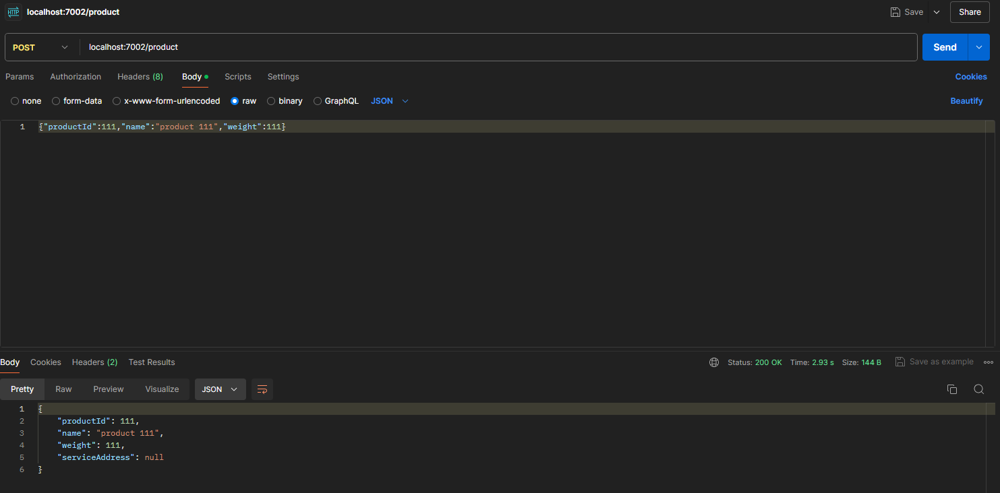
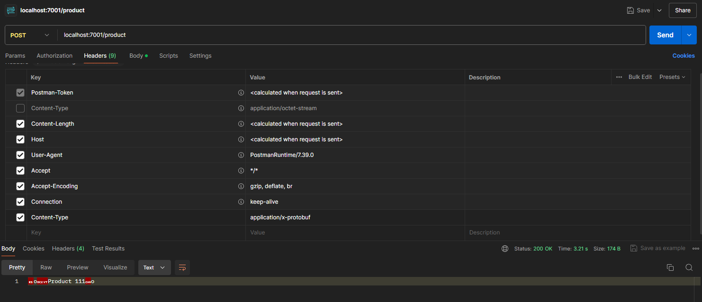

# Introduction to protobuf

In this guide, I introduce you to protobuf and show you how
to use it in your applications. I will cover the basics of protobuf,
including how to define messages and how to serialize and deserialize
data.

## What is protobuf?

Protobuf is a language-neutral, platform-neutral, extensible way
of serializing structured data for use in communications protocols,
data storage, and more. It is a binary format that is optimized for
speed and size. Protobuf is designed to be simple and efficient, and
it is widely used in many industries.

Protobuf is a great choice for serializing structured data because
it is fast, efficient, and easy to use. It is also extensible, which
means that you can add new fields to your data without breaking
existing code. Protobuf is a great choice for many applications,
including network communication, data storage, and more.

## How does protobuf work?

Protobuf works by defining a message format in a `.proto` file. This
file contains the definition of the message fields and their types.
Once you have defined your message format, you can use the `protoc`
compiler to generate code in your language of choice that can
serialize and deserialize data in that format.

Protobuf messages are serialized into a binary format that is
optimized for speed and size.

## Defining messages

To define a message in protobuf, you create a `.proto` file that
contains the definition of the message fields and their types. Here
is an example of a simple message definition:

```protobuf
syntax = "proto3";

message Person {
  string name = 1;
  int32 id = 2;
  string email = 3;
}
```

In this example, we define a message called `Person` with three
fields: `name`, `id`, and `email`. Each field has a type and a
unique field number.

## Generating code

Once you have defined your message format in a `.proto` file, you
can use the `protoc` compiler to generate code in your language of
choice that can serialize and deserialize data in that format. Here
is an example of how you might generate Java code from a `.proto`
file:

```bash
protoc --java_out=. person.proto
```

This command generates Java code from the `person.proto` file and
puts the generated code in the current directory.

You can download the `protoc` compiler from the gitHub repository
`https://github.com/protocolbuffers/protobuf/releases`.

## Serializing and deserializing data

Here is an example of how you might serialize and deserialize a 
`Person` message in Java:

```java 
// Serialize a Person message
Person person = Person.newBuilder()
  .setName("Alice")
  .setId(123)
  .setEmail("person@person.com")
    .build();
byte[] data = person.toByteArray();
    
// Deserialize a Person message
Person person = Person.parseFrom(data);
```

In this example, we use the `Person.newBuilder()` method to create
a new `Person` message, set its fields, and then call `build()` to
create the message. We then call `toByteArray()` to serialize the
message to a byte array. To deserialize the message, we call
`Person.parseFrom(data)`.

# PROTOBUF vs JSON

## Speed

Protobuf is faster than JSON because it is a binary format that is
optimized for speed. JSON is a text-based format that is slower
than protobuf because it requires parsing and serialization.

## Size

Protobuf is smaller than JSON because it is a binary format that is
optimized for size. JSON is a text-based format that is larger than
protobuf because it requires more space to store the data.

## Using protobuf and JSON

You can use protobuf and JSON in your applications by defining
messages in a `.proto` file and a `.json` file, respectively. You
can then use the `protoc` compiler to generate code in your language
of choice that can serialize and deserialize data in that format.

## Disadvantages of protobuf

- **Lack of resources**: you won't find that many resources (do not expect 
a very detailed documentation, nor too many blog posts).
- **Smaller community**: on Stack Overflow, for example, you will find 
roughly 1.500 questions marked with Protobuf tags. While JSON have more
than 180 thousand questions on this same platform.
- **Lack of support**: Google does not provide support for other programming
languages like Swift, R, Scala and etc... but, sometimes, you can overcome
this issue with third party libraries, like Swift Protobuf provided by Apple.
- **Non-human readability**: JSON, as exchanged on text format and with simple
structure, is easy to be read and analyzed by humans. This is not the case
with a binary format.

# PROJECT EXPLANATION

This project has  two microservices, both project will have the same 
functionality, but they will use different serialization formats. 
The first microservice will use JSON for serialization, and the second
project will use protobuf. In both are implemented a simple REST API 
that allows you to create, read, and delete `Product`. We can check the
performance of microservices, using jmeter to send requests, and see how
protobuf compares to JSON in terms of speed and size.

## PERFORMANCES TEST

The microservices will be tested using JMeter to send requests to the
API and measure the performance of the API. We will measure the
response time, the throughput and the size of the response data of the 
API for both microservices.

The plugin used to implement jmter is:

```pom.xml
<plugin>
    <groupId>com.lazerycode.jmeter</groupId>
    <artifactId>jmeter-maven-plugin</artifactId>
    <version>2.9.0</version>
    <executions>
        <execution>
            <id>jmeter-tests</id>
            <phase>verify</phase>
            <goals>
                <goal>jmeter</goal>
            </goals>
        </execution>
    </executions>
</plugin>
```

In the `src/test/jmeter` directory of each microservice there is
the `Benchmark.jmx` files that contain the test plan for the performance 
test. The test plan contains the following elements:

- ***Thread Group***: The thread group defines the number of threads
  and the number of requests to send to the API.
- ***HTTP Request***: The HTTP request sends a request to the API.
- ***Summary Report***: The summary report shows the response time
  and throughput of the API.
- ***View Results Tree***: The view results tree shows the response
  data of the API.
- ***Aggregate Report***: The aggregate report shows the response
  time and throughput of the API.

To run the performance test, you can use the following command:

```bash
mvn clean verify
```

This command generates a report in the `target/jmeter/results/` in 
each microservice directory.

## Product-service-json microservice

This microservice is a simple REST API. The API is implemented using
Spring Boot and uses JSON for serialization. The API has three endpoints:
`/products`, `/products/{id}`, and `/products/{id}`. You can use these
endpoints respectively to create, read, and delete `Product`.

## Product-service-protobuf microservice

### DEPENDENCIES

The microservice, to implement protobuf, uses the following dependencies:

```pomo.xml
<dependency>
            <groupId>com.google.protobuf</groupId>
            <artifactId>protobuf-java</artifactId>
            <version>4.27.0</version>
</dependency>
```
This dependency provides the necessary libraries to work with protobuf
in Java.

### PLUGIN

The microservice uses the `protobuf-maven-plugin` plugin to generate
Java code from the `.proto` file instead the protoc compiler. Here is
the configuration of the plugin in the `pom.xml` file:

```pom.xml
<plugin>
    <groupId>com.github.os72</groupId>
    <artifactId>protoc-jar-maven-plugin</artifactId>
    <version>3.14.0</version>
    <executions>
        <execution>
            <goals>
                <goal>run</goal>
            </goals>
            <phase>generate-sources</phase>
            <configuration>
                <protocVersion>3.14.0</protocVersion>
                <inputDirectories>
                    <include>src/main/resources</include>
                </inputDirectories>
                <outputTargets>
                    <outputTarget>
                        <type>java</type>
                        <outputDirectory>src/main/java</outputDirectory>
                    </outputTarget>
                </outputTargets>
            </configuration>
        </execution>
    </executions>
</plugin>
```

This plugin generates Java code from the `.proto` file in the
`src/main/protobuf/` directory and puts the generated code in the
`target/classes/{package_name_in_proto_file}` directory.

### MESSAGE DEFINITION

There are two `.proto` files in the `src/main/protobuf/` directory.

The file `product.proto` contains the definition of the `Product`
message. Here is the content of the `product.proto` file:

```protobuf
syntax = "proto3";

package com.luca.product;

option java_package = "com.luca.product.protobuf";
option java_outer_classname = "ProductProto";

message Product {
  int32 productId = 1;
  string name = 2;
  int32 weight = 3;
  string serviceAddress = 4;
}
```
The `Product` message has four fields: `productId`, `name`, `weight`,
and `serviceAddress`. Each field has a type and a unique field
number. The `Product` message is defined in the `com.luca.product`
package and is generated in the `com.luca.product.protobuf` package.

The file `ErrorInfo.proto` contains the definition of the `ErrorInfo` 
message. Here is the content of the `ErrorInfo.proto` file:

```protobuf
syntax = "proto3";

package com.luca.proto;

option java_package = "com.luca.util.protobuf";
option java_outer_classname = "ErrorInfoProto";

message ErrorInfo {
  string timestamp = 1;
  string path = 2;
  int32 httpStatus = 3;
  string message = 4;
}
```

The `ErrorInfo` message has four fields: `timestamp`, `path`, `httpStatus`,
and `message`. Each field has a type and a unique field number. The
`ErrorInfo` message is defined in the `com.luca.proto` package and is
generated in the `com.luca.util.protobuf` package.

### API IMPLEMENTATION

The API is implemented using Spring Boot and uses protobuf for
serialization. The API has three endpoints: `/products`, `/products/{id}`,
and `/products/{id}`. You can use these endpoints respectively to
create, read, and delete `Product`.

In the mapping of the endpoints, you have to specify the serialization
format.

For example, to create a `Product` using protobuf, you must send a
request with the `Content-Type` header set to `application/x-protobuf`:

```java
@PostMapping(
    value    = "/product",
    consumes = "application/x-protobuf",
    produces = "application/x-protobuf")
Product createProduct(@RequestBody Product body);
```

importing the `Product` class from the generated code by the protobuf
plugin:

```java
import com.luca.product.protobuf.ProductProto.Product;
```

### ERROR HANDLING

I have implemented a custom error handler that returns an `ErrorInfo`
using protobuf because the error response, in Spring boot, is serialized
using json by default. 

### RUNNING THE PROJECT

You can clone the repository, open the project in IntelliJ IDEA, and
build and run the project inside IntelliJ IDEA by launching the command
`mvn run` in the project root folder.

You can also run the microservices containerizing them with Docker
launching the commands:

- `mvn clean package` (clean useful in the case of a new build and package
  to create the jar files)
- `docker compose up --build -d` (to build and run the containers)
- `docker compose down` (to stop the containers).

# USING API

## REQUESTS

### Product-service-json

#### POSTMAN

To send requests to the API, you can use a tool like Postman.

To create a `Product`, you can send a POST request to the `/products`
endpoint with the following body for the RestAPI-json:

```json
{
  "productId": 1,
  "name": "Product 1",
  "weight": 100
}
```

Here is an example:



#### CURL

You can also use curl to send requests to the API. Here is an example
of how you might create a `Product` using curl:

```bash
curl -X POST http://localhost:7002/product \
  -H "Content-Type: application/json" \
  -d '{
        "productId": 1,
        "name": "Product 1",
        "weight": 1
      }'
```

### Product-service-protobuf

#### POSTMAN

To create a `Product`, you can send a POST request to the `/product`
endpoint with a binary body for the RestAPI-protobuf. 

I advise you to use tools to like `https://www.protobufpal.com/` to 
create the hexadecimal body and `https://gchq.github.io/CyberChef/#recipe=From_Hex('Auto')&input=MDg2ZjEyMGI1MDcyNmY2NDc1NjM3NDIwMzEzMTMxMTg2ZjIyMDA&oeol=VT`
to convert the hexadecimal body in binary and save it in a file. 

You can also create the binary file using the `protoc` compiler: 

```bash
protoc --encode=com.luca.product.protobuf.ProductProto.Product \
  src/main/resources/product.proto \
  <(echo 'productId: 1 name: "Product 1" weight: 1') \
  > product.bin
```

In Postman, you can import the file ad the request body and set the header
`Content-Type` to `application/x-protobuf`.

Here is an example:



#### CURL

You can also use curl to send requests to the API. Here is an example
of how you might create a `Product` using curl:

```bash
curl -X POST http://localhost:7001/product \
  -H "Content-Type: application/x-protobuf" \
  --data-binary @product.bin
```
                                          
The file `product.bin` contains the binary data of the `Product` message
and must be located in the same directory as the curl command. It can be
created using the method used in Postman.

## Resources

- [Protocol Buffers](https://developers.google.com/protocol-buffers)
- [Protocol Buffers vs JSON](https://auth0.com/blog/beating-json-performance-with-protobuf/)
- [Protocol Buffers Java](https://protobuf.dev/getting-started/javatutorial/)
- [Protocol Buffers Maven Plugin](https://github.com/os72/protoc-jar-maven-plugin)
- [JMeter](https://jmeter.apache.org/)
- [JMeter Maven Plugin](https://github.com/jmeter-maven-plugin/jmeter-maven-plugin)


